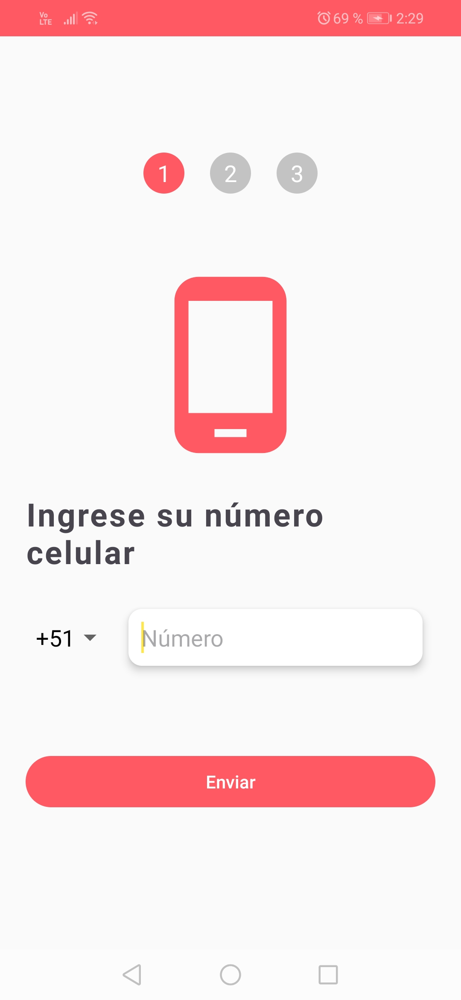
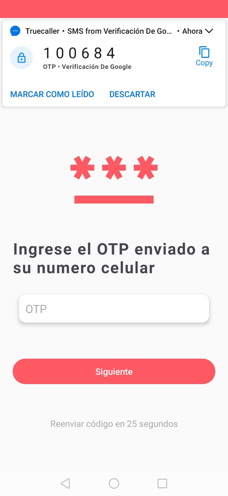
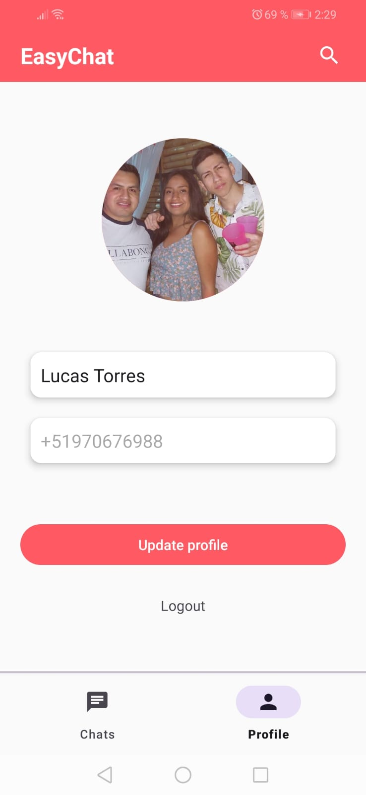

# App-Chat
Aplicación con herramientas de Firebase.
Firebase Authentication para la autenticación por el número celular. 
Firebase Firestore como base de datos NoSQL
Firebase Storage para almacenar las imágenes
Firebase Cloud Messaging (FCM) para las notificaciones. 

  
  
  
  
  

